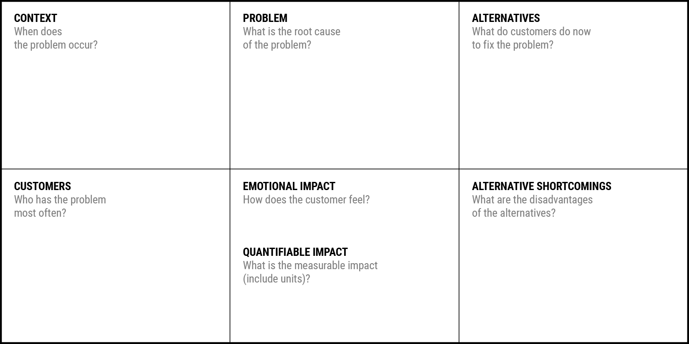

La première chose est de bien comprendre qu'une startup est un business, pas un produit. Il ne faut donc pas commencer
par construire la bonne solution, mais par trouver le bon problème. Une fois que le problème sera bien identifié et
compris, construire la solution qui permettra de créer un bon business sera plus simple.

## L'énoncé du problème

Identifier un problème consiste à étudier en profondeur les symptômes, les clients, les impacts, les alternatives, les
opportunités en évitant le "biais de la solution".

On peut regrouper tout cela dans un "Problem Statement Canvas".

Le modèle de canvas peut être
téléchargé [ici](https://docs.google.com/spreadsheets/d/1PSVtth0kZXQ9doPAU3l5ZKZ6w14ekxRAa0x0WLn_sBE/edit#gid=0)

## Être sûr d'avoir d'avoir identifié le vrai problème ?

Vous devez maintenant être sûr d'avoir identifié le problème à la source et pas les symptômes.

Pour ce faire, vous pouvez utiliser la technique "[Root cause analysis](http://www.designkit.org/methods/66)" qui
consiste, si je simplifie, à creuser en demandant cinq fois d'affilée "Pourquoi ?".

Exemple pour une voiture ne démarre pas :

- Premier pourquoi ? "La batterie est morte"
- Deuxième pourquoi ? "L'alternateur ne fonctionne plus"
- Troisième pourquoi ? "L'alternateur est cassé"
- Quatrième pourquoi ? "L'alternateur avait dépassé sa durée de vie et n'a pas été réparé"
- Cinquième pourquoi ? "Le véhicule n'a pas été contrôlé dans les délais comme elle aurait dû l'être"

On peut ainsi passer d'un problème simplement décrit comme "Coincé dans les embouteillages" à "Pourrait faire des choses
plus intéressantes que d'être simplement coincé en voiture".

Voici d'autres exemples:

- Dropbox : “People want to share files and are dependent on their pen drives”
- Uber : “Peoples loose time in traffic instead of doing something useful”
- Netflix : “Going to the video store is a pain. People don’t like traveling back and forth just to rent a movie, and
  they hate paying late fees even more”
- Airbnb : "Traveling is growing at X% but booking a hotel is one of the biggest concerns for travelers"
- Coinbase : "Bitcoin usage is growing quickly among early adopters, but it’s complicated to buy and store it"
- SpaceX : "As insurance against humanity’s existential risk, we need to develop rockets that can help us colonize Mars"

## Est-ce un bon problème ?

De l’idée la plus simple à celle la plus complexe, il existe quelques critères à respecter pour augmenter ses chances de
succès. La liste la plus pertinente que nous ayons trouvée est celle proposée par Sequoia Capital :

- S’adresser à des marchés larges qui existent déjà. Cela permet d’avoir du temps pour se développer et percer.
- S’adresser à des clients riches qui se décideront généralement plus vite et pourront même payer un peu plus pour une
  offre premium.
- Être “focus”, c’est à dire être concentré sur ce que l’on veut offrir. Les clients achètent plus facilement des
  produits simples avec une proposition de valeur claire.
- Être un “pain killer”. Cette technique s’applique en deux temps : identifier LE point qui pose un problème à votre
  prospect, puis le ravir avec une solution qui règle élégamment ce souci.
- Avoir une très bonne équipe. Pour réussir, il faut tout simplement avoir les meilleurs à ses côtés. L’équipe est
  souvent l’un des éléments du business plan le plus examiné.
- Rester agile. C’est cet avantage clé qui permet de réussir face aux grandes entreprises.