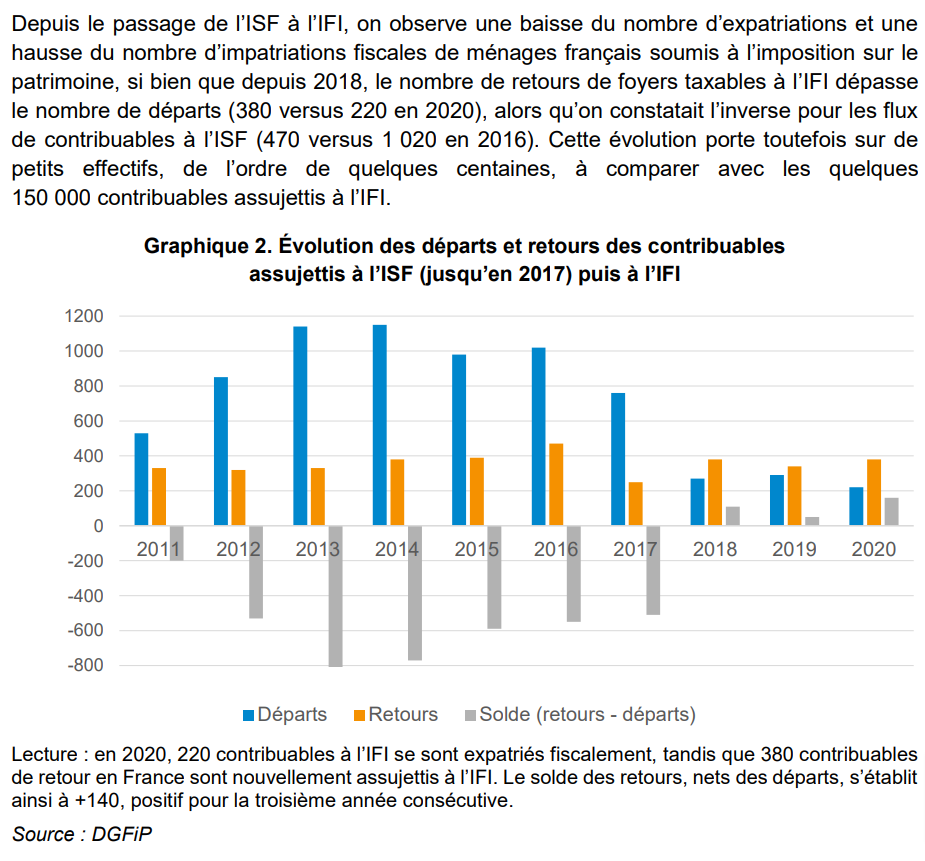

## Contrôle des prix

Le contrôle des prix ne marche jamais comme le montre l'exemple de
la [révolution française et sa gestion de l'inflation](https://www.lesechos.fr/economie-france/budget-fiscalite/1789-la-fabuleuse-inflation-des-assignats-1778629#xtor=CS1-26)
. En septembre 1793, les sans-culottes arrachent à Robespierre le blocage des prix. Dix mois plus tard, la pénurie ainsi
déclenchée est effroyable...

## Encadrement des loyers

Le [contrôle des loyers à Berlin](https://www.bloomberg.com/opinion/articles/2021-03-02/berlin-s-rent-controls-are-proving-to-be-the-disaster-we-feared)
est un désastre : protège les locataires existants aux dépens du reste de la population, en particulier les jeunes pour
qui il est impossible de trouver un logement : et voici la pénurie.

## L'ISF

L'évaluation de la suppression partielle de l'ISF, confiée à l’IPP, sera disponible d'ici octobre 2023. En attendant,
France Stratégie note que l'exode fiscal des assujettis à cet impôt s'est fortement réduit, et que les "retours"
surpassent les "départs".

## Biodiversité

Sans nier les problèmes qui sont nombreux, beaucoup d'exemples montrent que quand l'on veut, on peut.

Quasi éradiquées par le braconnage puis par une récente épidémie, les [antilopes saïga prospèrent au-delà de toutes les
espérances](https://www.newscientist.com/article/2333567-saiga-antelopes-have-increased-10-fold-after-mass-die-off-in-2015/) :
130.000 en 2015, 1,3 million aujourd'hui. C'est le plus puissant et rapide rétablissement d'une espèce
jamais réalisé.