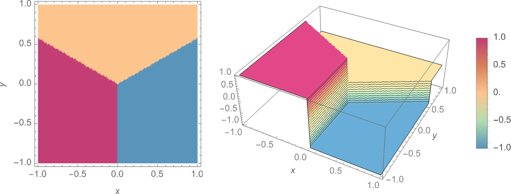

Cet article a été écrit grâce à la lecture de [What Is ChatGPT Doing... And Why Does It Work?](https://amzn.to/48pD4Au).
Les images sont aussi issus de ce livre, j'ai juste essayé d'en faire un résumé, un peu simplifié, avec quelques
bases en plus et en français.

## Introduction.

Comme cela a été expliqué à de nombreuses reprises, basiquement, ce que ChatGPT fait, c'est d'essayer de produire
un texte qui soit une suite de mots raisonnablement cohérents - Cohérent signifiant ici que le texte produit par le
modèle est similaire à ce que l'on pourrait attendre d'un humain qui aurait lu des millions de pages webs.

Le LLM que vous utilisez a lu des millions de pages webs. D'un point de vue très simplifié, s'il écrit "Le chat est"
et veut trouver le mot suivant dans sa phrase, il va regarder le mot qui vient le plus souvent après "Le chat est" dans
tout ce qu'il a lu et va le proposer. Cela va donner le mot "animal" par exemple - Bien sûr, il y avait d'autres
possibilités (mignon, félin...).

Fondamentalement, le système pour chaque mot se repose la question "étant donné le texte écrit jusqu'à présent, quel
devrait être statistiquement le prochain mot ?". L'idée est donc de créer un modèle qui permette d’estimer les
probabilités avec lesquelles des séquences de mots devraient se produire, même si ces séquences n'ont jamais été
explicitement vu dans le corpus de texte que nous avons donné au LLM.

## Qu'est-ce qu'un modèle ?

Imaginons, comme Galilée, que vous vouliez savoir combien de temps cela prend à un boulet de canon lâché d'un étage
particulier de la tour de Pise pour atteindre le sol. La solution la plus simple est de mesurer le temps que cela prend
pour chacun des étages.

L'autre façon de faire, c'est de modéliser le problème afin de trouver une fonction qui, à partir de paramètres (ici
l'étage de départ), va vous donner le temps que cela prend pour le boulet de canon de tomber. Nous allons donc commencer
par réaliser quelques mesures et les représenter sur un graphique :

La question est donc : à partir des mesures reportées sur le graphique ci-dessus, comment trouver une fonction qui va
nous donner la valeur pour les étages où nous n'avons pas de mesures ?
On peut commencer par tracer une droite qui passe au plus près de tous les points que nous avons mesurés :

La ligne droite donne un résultat qui est assez proche de la réalité, mais il y a des points qui sont un peu loin de la
droite. En essayant une formule mathématique plus compliquée (`a + b x + c x2`), on arrive à quelque chose de mieux :

Tout modèle que vous utilisez possède une structure sous-jacente particulière, puis un ensemble de paramètres que vous
pouvez définir pour qu'il colle le plus possible à vos attentes. Dans le cas de ChatGPT, il y a 175 milliards de
paramètres.

## Modéliser des tâches humaines.

Pour des tâches humaines comme reconnaître les images, c'est un peu le même principe sauf qu'il n'existe pas de
formule mathématique simple pour le modéliser.

Imaginons que nous souhaitions faire de la reconnaissance d'images comme celles-ci (des chiffres) :

Nous allons suivre la façon de faire que nous avons décrite dans le précédent paragraphe "Qu'est-ce qu'un modèle ?"
et nous allons donc commencer par récupérer un certain nombre d'exemples d'images pour chacun des chiffres à fin de
bâtir notre modèle, par exemple :

Rien qu'avec l'exemple ci-dessus, nous voyons qu'une comparaison pixel à pixel n'est pas la solution pour
reconnaître des chiffres. Qui n'a jamais écrit rapidement un chiffre "7" qui ressemble à un chiffre "1" ! De plus,
nous souhaitons modéliser une activité humaine, et les humains, pour reconnaître des choses, ne font pas de
comparaison pixel par pixel.

Alors comment faire ? Nous allons essayer de trouver une fonction qui, à partir des pixels de l'image, va nous donner
la probabilité que l'image représente un chiffre particulier.
Nous allons donc considérer la valeur du niveau de gris de chaque pixel comme une variable Xi et nous allons trouver une
fonction qui une fois évaluées avec toutes ces variables nous indique de quel chiffre se trouve l'image... De la
même façon que nous avons trouvé une fonction qui détermine, pour chaque étage, le temps que mettait le boulet de canon
à tomber.

On a donc une fonction mathématique, prenant, en entrée, les valeurs des différents pixels de l'image, qui effectue
environ un demi million d'opérations mathématiques, et qui nous donne en sortie le chiffre que représente l'image.

## Réseaux de neurones.

Essayons maintenant de comprendre comment les modèles fonctionnent. Pour cela, nous allons nous intéresser à un modèle
particulier : le réseau de neurones (qui ont été inventés en 1940!).

Dans le cerveau, il existe environ 100 milliards de neurones. Chaque neurone est connecté à approximativement 10 000
autres neurones. Chacun d'entre eux peut produire un signal électrique qui est transmis à d'autres neurones. Chaque
signal dépend de signaux reçus par les neurones connectés (chaque connexion ayant des "poids différents" qui
impactent le résultat).

Quand on voit une image comme notre "4" ci-dessus, les photons de la lumière frappent la rétine de nos yeux et génèrent
un signal électrique qui est transmis aux cellules nerveuses. Le signal va ensuite se propager à travers plusieurs
couches de neurones. C'est ce processus qui va former une pensée dans notre cerveau et qui va nous permettre de dire : "
C'est un 4".

### Les attracteurs.

Un concept à comprendre dans les réseaux de neuronnes est celui d'attracteur. Un attracteur peut être vu comme un "point
de stabilité" ou une "zone de stabilité" dans l'espace des états d'un système dynamique. Ce sont des états vers
lesquels le système tend à évoluer, indépendamment de sa position initiale.

Si l'on veut se les représenter, regardez le dessin ci-dessus. Les points oranges sont les attracteurs, si vous
lâchez un quelque chose dans l'une des régions d'un attracteur, cette chose va tendre à se rapprocher de ce point.

Si l'on reprend notre exemple de reconnaissance de chiffres, on peut imaginer que les attracteurs sont les
différents chiffres que votre modèle peut reconnaître. Quand vous présentez une nouvelle image à votre réseau de
neurones, il va "positionner" l'image dans une région et la faire tendre vers l'attracteur le plus proche, pour vous
indiquer quel chiffre est sur votre image.

Dans le schéma ci-dessus, on voit que les attracteurs sont des points dans un espace à 2 dimensions. Dans notre
exemple de reconnaissance de chiffre, nous avons une image de 28*28 pixels, nous allons donc avoir un espace à 784
dimensions, notre image représentant un point dans cet espace, le chiffre deviné par le réseau de neurones étant le
point attracteur le plus proche.

### Cas concret avec un réseau de neurones.

Prenons un cas très simple :

Si l'on nous donne un point avec des coordonnées {x, y}, notre modèle doit savoir de quel point orange, il est le
plus proche. Le résultat doit correspondre au graphique ci-dessous:

