Cet article a été écrit grâce à la lecture de [What Is ChatGPT Doing... And Why Does It Work?](https://amzn.to/48pD4Au).
Les images sont aussi issus de ce livre, j'ai juste essayé d'en faire un résumé, un peu simplifié, avec quelques
bases en plus et en français.

## Introduction.

Comme cela a été expliqué à de nombreuses reprises, basiquement, ce que ChatGPT fait, c'est d'essayer de produire
un texte qui soit une suite de mots raisonnablement cohérents - Cohérent signifiant ici que le texte produit par le
modèle est similaire à ce que l'on pourrait attendre d'un humain qui aurait lu des millions de pages webs.

Le LLM que vous utilisez a lu des millions de pages webs. D'un point de vue très simplifié, s'il écrit "Le chat est"
et veut trouver le mot suivant dans sa phrase, il va regarder le mot qui vient le plus souvent après "Le chat est" dans
tout ce qu'il a lu et va le proposer. Cela va donner le mot "animal" par exemple - Bien sûr, il y avait d'autres
possibilités (mignon, félin...).

Fondamentalement, le système pour chaque mot se repose la question "étant donné le texte écrit jusqu'à présent, quel
devrait être statistiquement le prochain mot ?". L'idée est donc de créer un modèle qui permette d’estimer les
probabilités avec lesquelles des séquences de mots devraient se produire, même si ces séquences n'ont jamais été
explicitement vu dans le corpus de texte que nous avons donné au LLM.

## Qu'est-ce qu'un modèle ?

Imaginons, comme Galilée, que vous vouliez savoir combien de temps cela prend à un boulet de canon lâché d'un étage
particulier de la tour de Pise pour atteindre le sol. La solution la plus simple est de mesurer le temps que cela prend
pour chacun des étages.

L'autre façon de faire, c'est de modéliser le problème afin de trouver une fonction qui, à partir de paramètres (ici
l'étage de départ), va vous donner le temps que cela prend pour le boulet de canon de tomber. Nous allons donc commencer
par réaliser quelques mesures et les représenter sur un graphique :

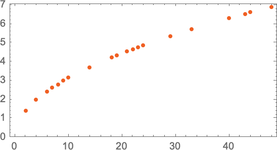

La question est donc : à partir des mesures reportées sur le graphique ci-dessus, comment trouver une fonction qui va
nous donner la valeur pour les étages où nous n'avons pas de mesures ?
On peut commencer par tracer une droite qui passe au plus près de tous les points que nous avons mesurés :

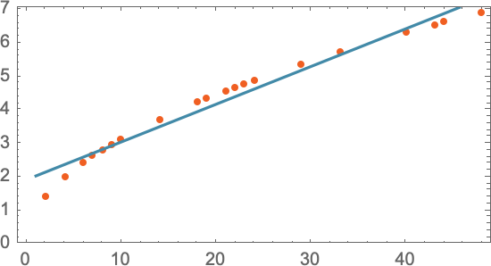

La ligne droite donne un résultat qui est assez proche de la réalité, mais il y a des points qui sont un peu loin de la
droite. En essayant une formule mathématique plus compliquée (`a + b x + c x2`), on arrive à quelque chose de mieux :

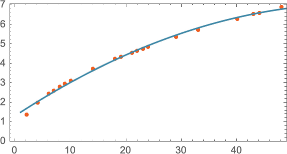

Tout modèle que vous utilisez possède une structure sous-jacente particulière, puis un ensemble de paramètres que vous
pouvez définir pour qu'il colle le plus possible à vos attentes. Dans le cas de ChatGPT, il y a 175 milliards de
paramètres.

## Modéliser des tâches humaines.

Pour des tâches humaines comme reconnaître les images, c'est un peu le même principe sauf qu'il n'existe pas de
formule mathématique simple pour le modéliser.

Imaginons que nous souhaitions faire de la reconnaissance d'images comme celles-ci (des chiffres) :
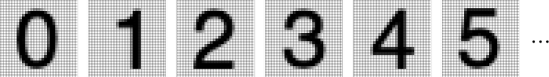

Nous allons suivre la façon de faire que nous avons décrite dans le précédent paragraphe "Qu'est-ce qu'un modèle ?"
et nous allons donc commencer par récupérer un certain nombre d'exemples d'images pour chacun des chiffres à fin de
bâtir notre modèle, par exemple :
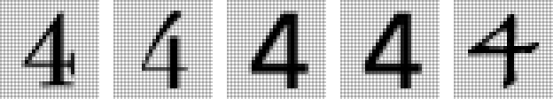

Rien qu'avec l'exemple ci-dessus, nous voyons qu'une comparaison pixel à pixel n'est pas la solution pour
reconnaître des chiffres. Qui n'a jamais écrit rapidement un chiffre "7" qui ressemble à un chiffre "1" ! De plus,
nous souhaitons modéliser une activité humaine, et les humains, pour reconnaître des choses, ne font pas de
comparaison pixel par pixel.

Alors comment faire ? Nous allons essayer de trouver une fonction qui, à partir des pixels de l'image, va nous donner
la probabilité que l'image représente un chiffre particulier.
Nous allons donc considérer la valeur du niveau de gris de chaque pixel comme une variable Xi et nous allons trouver une
fonction qui une fois évaluées avec toutes ces variables nous indique de quel chiffre se trouve l'image... De la
même façon que nous avons trouvé une fonction qui détermine, pour chaque étage, le temps que mettait le boulet de canon
à tomber.

On a donc une fonction mathématique, prenant, en entrée, les valeurs des différents pixels de l'image, qui effectue
environ un demi million d'opérations mathématiques, et qui nous donne en sortie le chiffre que représente l'image.

## Réseaux de neurones.

Essayons maintenant de comprendre comment les modèles fonctionnent. Pour cela, nous allons nous intéresser à un modèle
particulier : le réseau de neurones (qui ont été inventés en 1940!).

Dans le cerveau, il existe environ 100 milliards de neurones. Chaque neurone est connecté à approximativement 10 000
autres neurones. Chacun d'entre eux peut produire un signal électrique qui est transmis à d'autres neurones. Chaque
signal dépend de signaux reçus par les neurones connectés (chaque connexion ayant des "poids différents" qui
impactent le résultat).

Quand on voit une image comme notre "4" ci-dessus, les photons de la lumière frappent la rétine de nos yeux et génèrent
un signal électrique qui est transmis aux cellules nerveuses. Le signal va ensuite se propager à travers plusieurs
couches de neurones. C'est ce processus qui va former une pensée dans notre cerveau et qui va nous permettre de dire : "
C'est un 4".

### Les attracteurs.

Un concept à comprendre dans les réseaux de neuronnes est celui d'attracteur. Un attracteur peut être vu comme un "point
de stabilité" ou une "zone de stabilité" dans l'espace des états d'un système dynamique. Ce sont des états vers
lesquels le système tend à évoluer, indépendamment de sa position initiale.

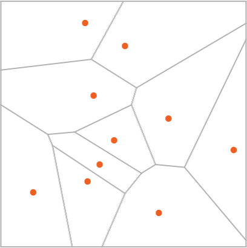

Si l'on veut se les représenter, regardez le dessin ci-dessus. Les points oranges sont les attracteurs, si vous
lâchez un quelque chose dans l'une des régions d'un attracteur, cette chose va tendre à se rapprocher de ce point.

Si l'on reprend notre exemple de reconnaissance de chiffres, on peut imaginer que les attracteurs sont les
différents chiffres que votre modèle peut reconnaître. Quand vous présentez une nouvelle image à votre réseau de
neurones, il va "positionner" l'image dans une région et la faire tendre vers l'attracteur le plus proche, pour vous
indiquer quel chiffre est sur votre image.

Dans le schéma ci-dessus, on voit que les attracteurs sont des points dans un espace à 2 dimensions. Dans notre
exemple de reconnaissance de chiffre, nous avons une image de 28*28 pixels, nous allons donc avoir un espace à 784
dimensions, notre image représentant un point dans cet espace, le chiffre deviné par le réseau de neurones étant le
point attracteur le plus proche.

### Cas concret avec un réseau de neurones.

Prenons un cas très simple :

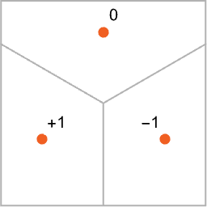

Si l'on nous donne un point avec des coordonnées {x, y}, notre modèle doit savoir de quel point orange, il est le
plus proche. Le résultat doit correspondre au graphique ci-dessous:

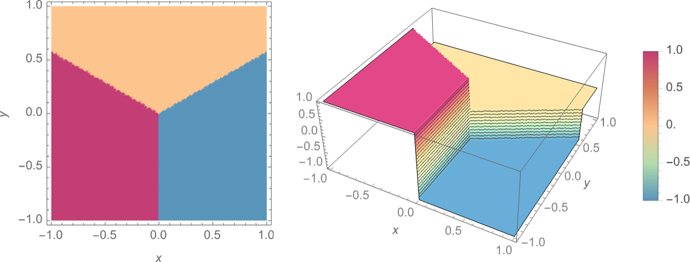

Un réseau de neuronnes, ça ressemble au schéma ci-dessous. On y voit des neuronnes, organisés en couches. Chaque neurone
est connecté à tous les neurones de la couche précédente et de la couche suivante.

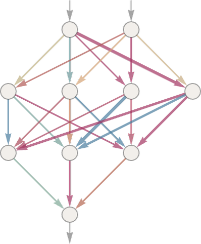

Chaque neurone va évaluer une valeur avec une fonction mathématique. Pour utiliser le réseau, nous allons simplement
entrer nos coordonnées {x, y} dans les deux premiers neurones du réseau et laisser chaque neurone faire son calcul
et passer le résultat à la couche suivante. Le résultat final sera donné par le dernier neurone.
Bien sûr, mettre en place le réseau de neuronnes n'est pas suffisant, les résultats seront aléatoires. Il va falloir
le "calibrer" pour qu'il donne les résultats que nous attendons, c'est ce que l'on appelle l'entrainement.

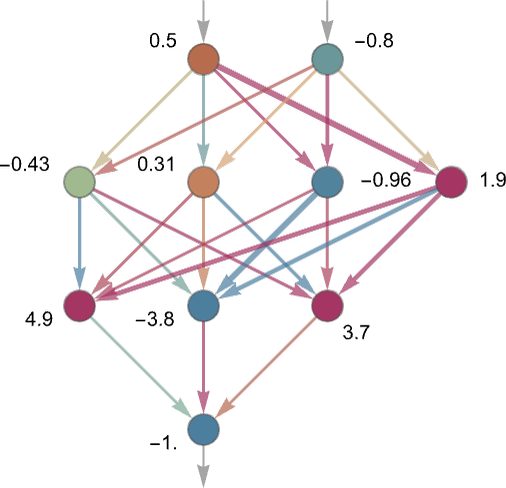

Comme nous pouvons le voir sur le schéma, chaque neurone reçoit des valeurs de plusieurs neurones de la couche
précédente et chaque connexion a un "poids" (positif ou négatif) qui va influencer le résultat - ceci permet de
modifier "l'importance" de chacune des entrées. Le "calibrage" du réseau de neurones consiste à trouver les bons
poids pour chaque connexion afin que le résultat final soit bon dans la majeure partie des cas présentés.

La valeur d’un neurone donné est déterminée en multipliant les valeurs des « neurones précédents » par leurs poids
correspondants et en les additionnant. On se retrouve donc à multiplier des matrices.

Enfin, on applique une fonction de « seuil » (ou « d’activation ») qui, comme vous pouvez le voir dans les exemples
ci-dessous, va transformer une valeur obtenue en entrée en une valeur de sortie. C’est cette fonction qui va donner
la valeur finale du neurone.

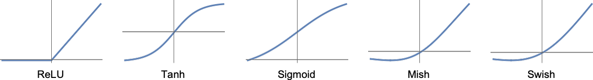

Les poids des connexions entre les neurones sont les paramètres du modèle, ils vont êtres calibrés en utilisant les
résultats que nous souhaitons obtenir.

Si l'on reprend notre exemple de reconnaissance de chiffres, nous allons devoir :

- Entrer une image dans le réseau de neurones.
- Laisser le réseau de neurones faire ses calculs.
- Comparer le résultat obtenu avec le chiffre que nous attendions.
- Modifier les poids des connexions pour que le résultat obtenu soit plus proche de ce que nous attendions.
- Recommencer avec une autre image.

Revenons à notre exemple, avec un seul neurone, voici ce que nous pouvons générer comme résultat :

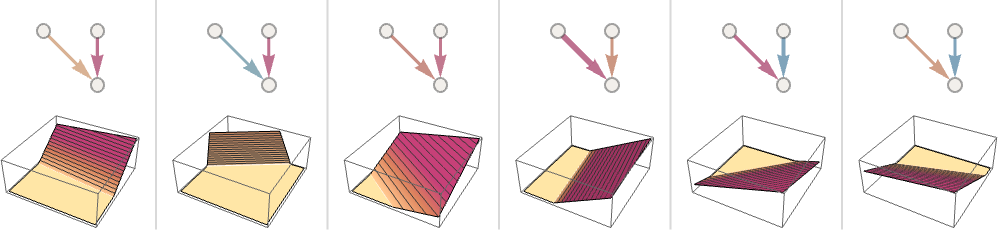

Comme vous le voyez, nous n'arrivons pas à générer un résultat qui ressemble à ce que nous attendons. Par contre, si
nous rajoutons des neurones et refaisons l'entrainement, nous arrivons à cela, c'est mieux :

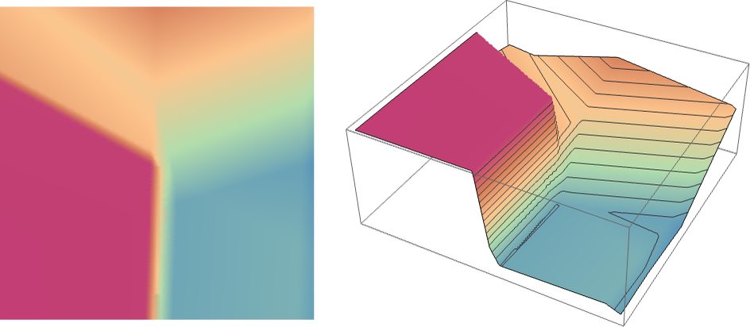

Généralement, plus le réseau est gros, plus il est capable de faire une approximation précise de la fonction que nous
recherchons comme on peut le voir ci-dessous.

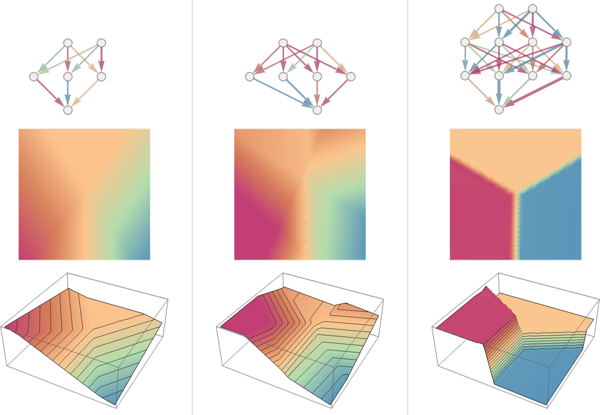

## L'entrainement des réseaux de neurones.

L'avantage des réseaux de neurones est que l'on ne les programme pas, on ne va pas essayer de coder une fonction qui
va chercher la barre du 7, la boucle du 8, etc. Au lieu de celà, on va juste lui montrer plein d'exemples des
résultats que l'on souhaite obtenir, lui va "généraliser" les exemples qu'on lui fournit.

L'entrainement, concrètement, c'est trouver les valeurs des poids des connexions entre les neuronnes qui vont
permettre de reproduire les exemples qu'on lui a donnés.

Prenons un exemple très simple, essayons d'apprendre à un réseau de neurones à reproduire la fonction ci-dessous :

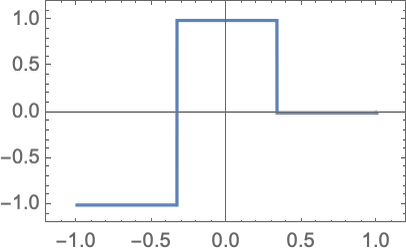

Voici le réseau de neuronnes utilisé :

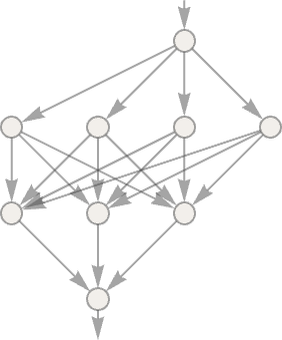

Si on met des poids au hasard, le réseau de neuronnes va calculer différentes fonctions qui ne sont pas du tout ce
que l'on souhaite :

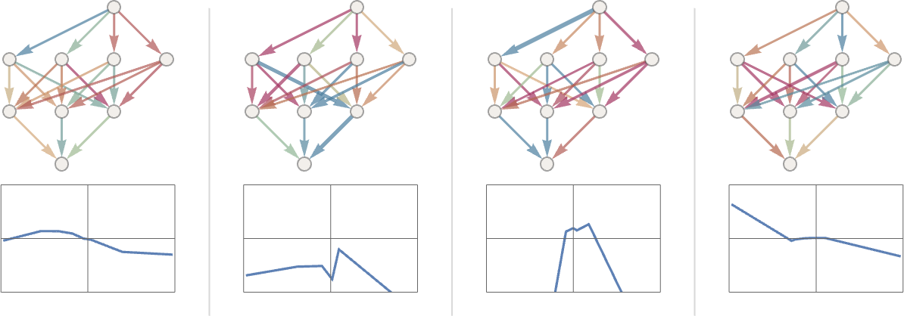

Pour l'entrainer, l'idée est de fournir beaucoup d'exemples de ce que l'on souhaite obtenir et d'essayer de trouver
les poids qui vont permettre de reproduire ces exemples.

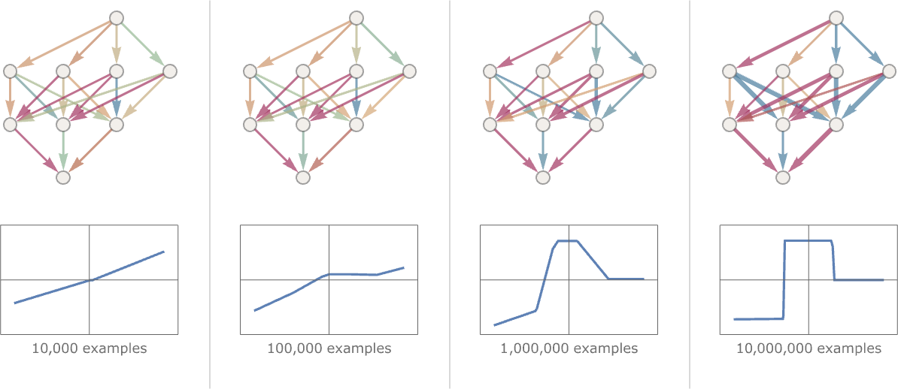

On peut voir qu'à chaque étape de l'entrainement, le réseau de neurones se rapproche de la fonction que nous
souhaitons, mais comment sont ajustés les poids ? L'idée ici est de se demander à chaque étape "à quel point je suis
éloigné du résultat que je souhaite ?".

C'est là qu'intervient la fonction de perte ou de coût. Elle est la quantification de l'écart entre les prévisions du
modèle et les observations réelles du jeu de donnée utilisé pendant l'entraînement. Elle nous donne la distance
entre les valeurs que nous avons et les valeurs que nous voulons.

Imaginons un instant que l'on ait deux poids w1 et w2 et que l'on ait une fonction de perte qui ressemble à cela:

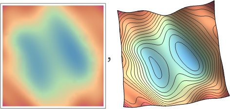

Nous allons donc essayer de trouver les valeurs de w1 et w2 qui vont minimiser la fonction de perte. Pour cela, nous
allons suivre le chemin de la descente la plus raide à partir des w1 et w2 précédents que nous avons eus.

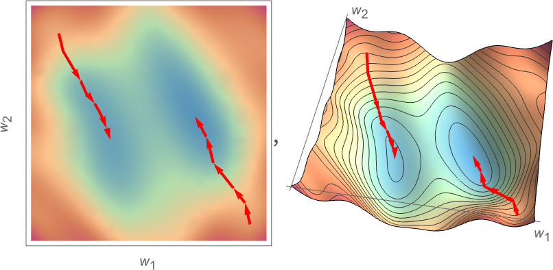

Quelque part, imaginez-vous que quand on choisit un poids au hasard, on le place au hasard sur une montagne. L'objectif
va être de trouver le chemin le plus raide pour descendre de la montagne afin d'atteindre l'altitude la plus basse
possible. C'est ce que l'on appelle la descente de gradient!

## L'entrainement de réseaux de neurones en pratique

Tout d'abord, ce n'est pas une science exacte, on suit des processus essai-erreurs-corrections avec un ensemble d'idées
et d'astuces qui ont été développées au fil du temps.

La première question à se poser, quelle taille doit avoir mon réseau de neurone pour une tâche donnée ? C'est assez
difficile à estimer même si plus une tâche est complexe, plus le réseau de neurones semble devoir être grand.

Dans l'exemple ci-dessous, il est facile de voir que si le réseau est trop petit, il est impossible de reproduire la
fonction que nous cherchons. Attention, si le réseau est trop grand, il va reproduire la fonction que nous cherchons,
mais aussi les "bruits" que nous avons dans nos données d'entrainement.

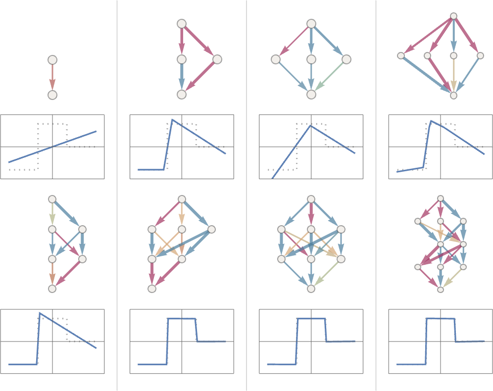

Maintenant que nous avons choisi une architecture pour notre réseau de neuronnes, il va falloir récupérer des
données pour l'entrainer. Pour cela, il va falloir les nettoyer, les préparer, les transformer, les augmenter, etc.
L'autre question qui se présente est "de combien de données ai-je besoin pour entrainer mon réseau de neurones ?".
Comme pour la taille du réseau, il est difficile de répondre à cette question.

Même s'il existe des techniques pour récupérer des connaissances déjà acquises (comme le transfer learning), il va
globalement falloir beaucoup de données avec, si possible, beaucoup de données répétitives (un peu comme les humains
ont besoin de voir souvent la même information pour qu'elle s'inscrive dans sa mémoire).

Et pour ChatGPT ? pour l'entrainer, il suffit de prendre beaucoup de textes et de masquer la fin des phrases, ceci
lui servira d'entrées à partir de laquelle s'entraîner, la fin des phrases étant les sorties attendues.

Comme nous l'avons vu, l'objectif de l'entrainement est de trouver les poids (ou paramètres) qui vont permettre
d'obtenir les bonnes sorties pour les bonnes entrées avec la fameuse fonction de perte. L'ensemble du processus
consiste à faire baisser cette fonction de perte.

Généralement, elle va baisser puis stagner. Si elle stagne et que l'on est à un point assez bas, c'est que l'on a
atteint un minimum local, c'est que l'on a fini l'entrainement. Si elle stagne et que l'on est à un point assez haut,
c'est qu'il y a quelque chose qui ne va pas.

## Les embeddings

Nous l'avons vu, les réseaux de neuronnes sont basés sur des nombres, nous avons donc besoin de représenter les
textes par des nombres.

On pourrait choisir un nombre au hasard pour chaque mot, mais l'idée, fondamentale chez ChatGPT, est de représenter
l'essence d'un mot comme "pomme" par un tableau de nombres - Et si ce mot est proche d'un autre mot comme "banane,
les valeurs du tableau de nombres du mot banane seront proches de des valeurs du tableau de nombre de "pomme". C'est ce
que l'on appelle un embedding.

On peut voir cela comme une tentative de représenter un "espace de signification" dans lequel les mots sont placés
sur une carte les uns à proximités des autres en fonction de leur signification. Si on essayait de faire une carte
en seulement deux dimensions, cela donnerait cela :

Les animaux sont dans un "coin", les "fruits" dans un autre, le chien et le chat sont proches comme alligator et
crocodile. Ceci est généré assez simplement en regardant d'énormes quantités de texte et en regardant à quel point
des mots apparaissent dans des contextes similaires. Par exemple, "alligator" et "crocodile" vont apparaître souvent de
manière presque interchangeable dans des phrases par ailleurs semblables, on va donc les mettre "à côté".

