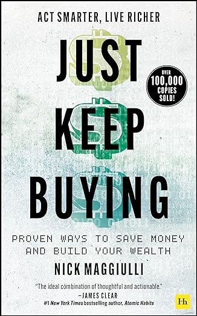

## Introduction

Ce résumé a été réalisé, notamment, grâce au livre [Just Keep Buying](https://amzn.to/3VyIsf4) de Nick Maggiulli.

## Pourquoi investir ?

Il y a trois bonnes raisons d'investir :

- Pour économiser pour votre futur, car il arrivera un moment où vous ne pourrez plus/voudrez plus travailler.
- Pour vous préserver de l'inflation, car le prix des choses que vous achetez va continuer à grimper et l'euro que vous
  mettez de côté aujourd'hui ne permettra d'acheter les mêmes choses dans dix ans.
- Pour remplacer votre capital humain par du capital financier, car vos compétences ne vous permettront pas forcément de
  tirer les mêmes revenus au fur et à mesure que les années passent.

## Dans quoi investir ?

La règle de base est d'investir de manière dans différentes choses, bref de ne pas mettre tous ses œufs dans le même
panier.

### Actions

Les actions représentent des titres de propriétés dans des entreprises qui sont les institutions les plus à même de
créer de la valeur dans notre économie. Sur le long terme, on est généralement gagnant, la rentabilité des actions aux
USA sur les 205 dernières années est de 6,8% par an.

Par contre, il faut accepter les chocs! Si vous possédez des actions, vous devez vous attendre à les voir chuter de plus
de 50% deux fois par siècles, 30% une fois tous les 4 à 5 ans et 10 % régulièrement.

Choisir quelle action acheter n'est pas simple. Pour apprendre quelque chose, vous avez généralement besoin de ce que
l'on appelle une boucle de feedback. Si vous apprenez, par exemple, à jouer aux échecs et que votre niveau n'est pas
très élevé, vous perdrez rapidement et fréquemment contre un bon adversaire, mais chaque défaite vous enseignera ce
qu'il faut faire et ne pas faire. Avec les actions, c'est plus compliqué, car la boucle de feedback peut être très
longue! Une action achetée aujourd'hui peut plonger énormément sur un an (vous vous dites que c'est un mauvais choix et
donc vous vendez) et triplez sur deux ans (vous vous dites alors que vous êtes nul).

Une des solutions est d'acheter des ETF (Exchange Traded Fund) qui représentent un panier de valeurs se négociant en
bourse. Ils offrent la possibilité d’investir sur l’ensemble d’un marché au lieu de choisir des actions distinctes,
permettant une réelle diversification. Par exemple, vous pouvez acheter un ETF qui va reproduire les résultats du S&P
500 (l'indice boursier basé sur 500 grandes sociétés cotées sur les bourses aux États-Unis). Ainsi, vous n'aurez pas
besoin de bâtir vous-même un portefeuille d'actions américaines diversifiées, vous achetez simplement l'ETF.

Personnellement, j'investis un peu chaque mois dans trois ETF représentant les actions américaines, européennes &
marchés émergeants.

### Obligations

Les obligations sont des prêts qui doivent être remboursés sur une certaine période de temps. Cette période de temps est
appelé terme ou maturité. Les obligations les plus connues sont les bons du trésor américain, qui sont en fait des
emprunts faits par le gouvernement américain.

Ils ont différents termes :

- Treasury bill (1-12 mois).
- Treasury notes (2-10 ans).
- Treasury bonds (10-30 ans).

Il existe aussi des obligations créées par d'autres gouvernements, des entreprises, ou même certaines villes. Bien
qu'ils promettent un meilleur rendement, ils sont aussi plus risqués.

Ce sont des bons placements dans le sens où :

- Ils ont tendance à monter quand le marché des actions baisse. Quand ça va mal, les investisseurs ont tendance à vendre
  certaines actions pour aller vers les obligations qui, elles, sont "sans risque".
- Leur flux de revenus est plus constant que les autres types d'actifs.
- Ils fournissent des liquidités qui vous permettent d'adapter votre portefeuille au fur et à mesure du temps.

Vous pouvez acheter des obligations directement ou via un ETF.

Une citation à se rappeler : "On achète des actions pour bien manger et des obligations pour bien dormir".

### Crypto

Les deux précédents investissements sont beaucoup moins risqués que les cryptomonnaies. Cependant, je pense, à titre
personnel, qu'investir chaque mois 20% des investissements dans l'achat de Bitcoin est une bonne idée sur le long terme.

Afin de ne pas paniquer, il vaut mieux mettre en place ne solution comme stackinsat, et par exemple n'acheter que 100 ou
200 € de cryptos par mois, de manière automatique et vers un portefeuille dont vous possédez les clés.

## Quand investir ?

L'information la plus importante à avoir en tête est la suivante : "la plupart des marchés d'actions montent la plupart
du temps". Malgré deux guerres mondiales, de nombreux conflits, la grande dépression, des dizaines de récessions, le
choc pétrolier, les épidémies... le dow jones est passé en un siècle 77 à 11 497.

À partir cette constatation, il semble clair qu'il faut investir votre argent aussi rapidement que vous le pouvez. Vous
pouvez attendre que cela baisse avant mais la réalité, c'est que ça risque surtout de monter avant que vous ne preniez
votre décision.

Donc, investissez autant que vous pouvez, aussi vite que vous pouvez, sans attendre l'hypothétique "meilleur prix".

Après avoir analysé le rendement des marchés de 39 pays entre 1841 et 2019, la probabilité de ne pas battre l'inflation
est de seulement de 12%.

## Quand vendre ?

Comme les marchés ont tendance à monter, le meilleur moment pour vendre est le plus tard possible :) Vendre au fur et à
mesure est plus intéressant que de vendre tout, tout de suite.

Une des bonnes raisons de vendre est de rééquilibrer son portefeuille. En effet, comme les actions grimpent plus vite
que les obligations, si vous êtes partis avec un portefeuille 60% actions / 40 % obligations, au bout de quelques
années, vous risquez de vous retrouver avec un portefeuille dont la valeur sera de 80% actions / 20 % obligations.

Ce n'est pas forcément une mauvaise chose, mais vous devez comprendre que cela signifie prendre plus de risque. Il est
conseillé, une fois par an, de rééquilibrer son portefeuille. 