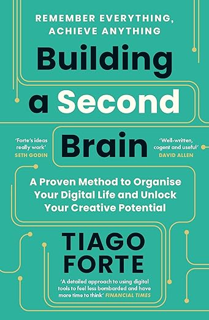

Ce chapitre sur la négociation se base essentiellement sur le
livre : [Résumé: Ne coupez jamais la poire en deux](https://amzn.to/3FD7ymZ).

Avant de passer à la technique, voici quelques éléments de base à retenir:

- Nous ne sommes finalement que des animaux irrationnels, impulsifs, contrôlés par nos émotions. Ceci doit toujours être
  gardé à l'esprit et ne comptez pas trop sur le rationnel.
- Les gens veulent être **compris** et **acceptés**.
- Les écouter est la concession la plus facile et la plus efficace.
- La négociation remplit deux fonctions essentielles : **Collecter l’information** et **influencer les comportements**.