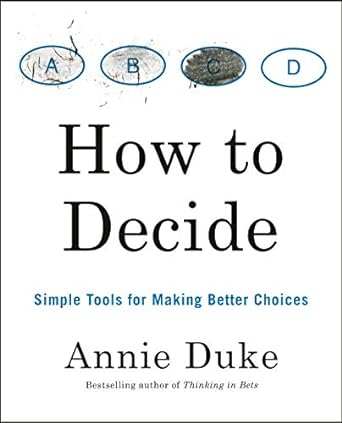

Un bon outil de décision cherche à **réduire le rôle des biais cognitifs** (tels que l'excès de confiance, le biais
rétrospectif ou le biais de confirmation) et utiliser une simple liste pour/contre tend à amplifier le rôle du biais.
Lorsque vous prenez une décision, votre objectif est de choisir l'option qui vous permet d'atteindre vos objectifs, en
tenant compte du risque que vous êtes prêt à prendre.

Parce qu'il y a tellement d'avenirs possibles, prendre la meilleure décision dépend de votre capacité à imaginer avec
précision à quoi le monde pourrait ressembler si vous deviez choisir l'une des options que vous envisagez.

**Premier biais** : le biais de résultat où vous utilisez la qualité d'un résultat pour déterminer la qualité d'une
décision. Vous pouvez griller un feu rouge et traverser l'intersection sans soucis. Vous pouvez griller un feu vert et
avoir un accident. Cela signifie que travailler à rebours à partir de la qualité d'un seul résultat pour déterminer si
une décision était bonne ou mauvaise vous conduirait à de mauvaises conclusions.

Même lorsque vous prenez une bonne décision, cela ne signifie pas que c'était la meilleure décision. En fait, c'est
rarement le cas. S'efforcer de s'améliorer signifie être prêt à lutter contre la complaisance qui peut découler d'une
bonne décision menant à un bon résultat.

**Deuxième biais** : le biais rétrospectif qui fait que l’on a tendance à croire qu'un événement, après qu'il se soit
produit, était prévisible ou inévitable (“Je le savais depuis le début”). Vous achetez de la crypto-monnaie. Votre
investissement quintuple. Vous dites à vos amis : “Je vous l'avais dit. Vous auriez dû investir aussi !” La
crypto-monnaie se plante et vous perdez tout l'argent que vous avez investi. Vous vous donnez des coups de pied en vous
disant: "J'aurais dû savoir vendre au plus haut!".

Vous pouvez repérer ce biais quand vous dites : "Je ne peux pas croire que je n'ai pas vu ça venir", ou "Je le savais",
ou "Je te l'avais dit", ou "J'aurais dû le savoir". S'entraîner à écouter ces indices mentaux et verbaux est un bon
moyen d'affiner vos compétences de repérage des préjugés rétrospectifs.

**Troisième biais** : quand ce que vous savez après coup se glisse dans votre mémoire de ce que vous saviez avant coup.

Vous ne vous souviendrez pas de ce que vous saviez au moment de la décision. Cela rend difficile pour vous de juger si
une décision était bonne ou mauvaise. Pour évaluer la qualité d'une décision et apprendre de votre expérience, vous
devez évaluer votre état d'esprit honnêtement et vous rappeler ce qui était connaissable ou non connaissable aussi
précisément que possible.

**Quatrième biais** : le paradoxe de l’expérience qui implique que l'expérience est nécessaire pour apprendre, mais les
expériences individuelles interfèrent souvent avec l'apprentissage, car ce sont des cas particuliers

Voici les six étapes à suivre pour prendre une bonne décision:

- Étape 1 : Identifier l'ensemble raisonnable de résultats possibles.
- Étape 2 : Identifiez votre préférence en utilisant le gain pour chaque résultat—dans quelle mesure aimez-vous ou
  n'aimez-vous pas chaque résultat, compte tenu de vos valeurs ?
- Étape 3 : Estimez la probabilité que chaque résultat se produise.
- Étape 4 : Évaluez la probabilité relative des résultats que vous aimez et que vous n'aimez pas pour l'option
  envisagée.
- Étape 5 : Répétez les étapes 1 à 4 pour les autres options envisagées.
- Étape 6 : Comparez les options entre elles.

**Vous pouvez identifier les décisions à faible impact avec le “test du bonheur”, en vous demandant si le résultat de
votre décision aura probablement un effet sur votre bonheur dans une semaine, un mois ou un an.**