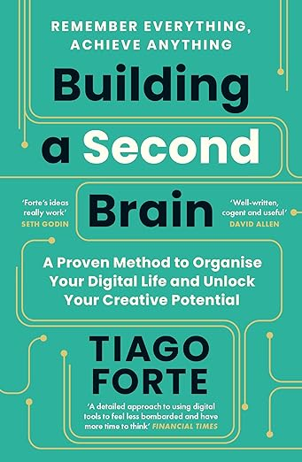

## Construire un second cerveau ? Quel est le but ?

Début 2021, je me suis mis comme objectif de lire un livre par semaine ce qui a été l'une des meilleures décisions de ma
vie. Cela a carrément changé ma façon de voir le monde, d'aborder les choses et de me comporter au jour le jour.
Cependant, cela représente beaucoup d'information et comme le dit David Allen "Votre esprit est fait pour avoir des
idées, pas pour les retenir."

La prise de note que l'on nous a appris à l'école considérait l'apprentissage comme essentiellement jetable, sans
intention que ces connaissances soient utiles à long terme. Alors que traitée correctement, une note est un "bloc de
connaissances" - une unité d'information discrète interprétée à travers votre point de vue unique et stockée en dehors
de votre tête pour être utilisée plus tard.

J'ai donc créé ce site suite à la lecture du livre [Building a Second Brain](https://amzn.to/3LQCulw) qui décrit une
méthode à la fois simple & élégante de se créer une base de connaissance. L'idée est d'avoir à portée de main une
collection de souvenirs, idées, connaissances, résumés, articles qui seront utiles pour le travail, le business et la
vie en général.

## Les quatre capacités essentielles du second cerveau

- **Rendre nos idées concrètes** : Avant de faire quoi que ce soit avec nos idées, nous devons les « décharger » de
  notre esprit.
- **Révéler de nouvelles associations entre les idées** : Dans sa forme la plus pratique, la créativité consiste à
  connecter des idées entre elles, en particulier des idées qui ne semblent pas avoir de liens.
- **Incuber nos idées au fil du temps** : Nous avons tendance à favoriser les idées, les solutions et les influences qui
  nous sont venus le plus récemment, qu'elles soient ou non les meilleures. Imaginez maintenant si vous pouviez vous
  libérer des limites du moment présent et puiser dans des semaines, des mois, voire des années d'imagination accumulée.
- **Aiguisez nos perspectives** : à force de raffiner et de relire, vous pourrez vous bâtir votre propre vision.

## La méthode CODE : les quatre étapes pour se souvenir de ce qui compte

- **C**apture : Ne conservez que ce qui résonne en vous.
- **O**rganize : Organisez vos notes pour qu'elles puissent servir à l'action.
- **D**istill : Trouver l'essence dans les notes que vous avez prises. "Comment rendre utile pour mon futur moi ?"
- **E**xpress : Montrez votre travail, car le savoir ne sert qu'à une chose : passer à l'action.

### Capture

Ne conservez que ce qui résonne en vous.

L'information est la nourriture du cerveau, ce n'est pas un luxe, c'est la chose qui vous permet de survivre.

La connaissance est partout, dans vos emails, dans les livres, dans les réunions, dans les vidéos Youtube, à la télé,
dans la rue... vous devez donc avoir toujours sur vous une application pour vous permettre de stocker rapidement tout ça
à tout moment. Personnellement, j'utilise [Google keep](https://keep.google.com/) sur mon téléphone et sur mon PC. Dès
que je vois, j'entends ou lis quelque chose d'intéressant, j'ajoute une note que je traiterai plus tard.

Richard Feynman avait une stratégie géniale, il gardait dans sa tête une douzaine de problèmes qu'il trouvait pertinent.
Dès qu'il entendait quelque chose de nouveau et d'intéressant, il regardait si cela pouvait faire avancer ses problèmes.
Si oui, il prenait en note !

Vous devez vous poser la question "Quelles sont les questions qui m'ont toujours intéressées ?" Cela peut être des
questions très larges comme "Comment rendre la société plus égalitaire ?" ou très pratique comme "Comment faire du sport
plus régulièrement ?".

Voici ensuite les critères pour choisi quoi capturer :

- Est-ce que cela m'inspire ?
- Est-ce utile ? Parfois ce n'est pas intéressant, mais c'est utile : statistique, référence, schéma...
- Est-ce surprenant ? Pour lutter contre le biais de confirmation, notez ce qui va contre vos croyances.

En moyenne, je capture deux ou trois idées par jour.

### Organize

Lorsque vous avez un projet, vous devez créer un dossier, un peu comme si vous achetiez une boite et que vous colliez le
nom du projet dessus. Cela vous permettra de vous sentir organisé, d'avoir un endroit où vous allez décharger votre
cerveau, mais c'est aussi une forme d'engagement à mener à bien votre projet. Le simple fait d'avoir créé et nommé un
dossier signifie que vous avez commencé à travailler dessus.

Quand vous aurez commencé à capturer des idées, vous devriez ressentir une certaine excitation, mais vous devriez
bientôt faire face à un nouveau problème : que faire de toutes ses informations ?

La façon de les organiser la plus efficace selon l'auteur est d'avoir quatre dossiers :

- **P**rojects : Ce sur quoi vous travaillez en ce moment (perso ou pro, mais pas plus de dix en même temps).
- **A**reas : Choses sur lesquelles j'aimerais travailler sur le long terme.
- **R**essources : Choses qui pourraient être utiles dans le futur.
- **A**rchives : Les sujets inactifs des trois précédentes catégories.

Avec cette organisation, quand vous devez trier une note, la question que vous devez vous poser est simplement : "Dans
quel projet cette information serait la plus utile ?".

Mais tout n'est pas un projet, par exemple la santé n'est pas un projet avec une date de fin. C'est quelque chose qui se
traite sur le long terme et sur lequel on doit constamment améliorer ses connaissances.

Les ressources, c'est tout ce qui n'est pas un projet ou un domaine, mais qui est un sujet qui m'intéresse comme, la
physique quantique ou l'agriculture.

Enfin, quand quelque chose est fini ou ne vous intéresse plus, vous le mettez aux archives. Comme ça, au cas où, vous
pourrez toujours le retrouver si cela revient sur le tapis.

Toutes les semaines, le mardi pour moi, je trie les notes que j'ai capturé dans Google Keep pour les ranger dans l'un
des quatre dossiers avec un processus très simple:

- Pour quel projet cette information peut être importante ?
- Sinon, dans quel domaine peut-elle être utile ?
- Sinon, est-ce que cela parle d'une ressource ?
- Sinon, archive.

### Distill

Pour distiller les notes et en tirer le meilleur parti, le mieux est de revenir plusieurs fois sur les notes et les
améliorer en faisant trois choses :

- En mettant en gras les phrases importantes.
- En surlignant les phrases contenant les idées fondamentales.
- En écrivant un résumé en haut de la note qui liste ce qu'il faut retenir sous forme de liste.

Améliorer une note peut se faire quand vous n'avez plus l'énergie d'avancer sur un sujet, vous prenez alors l'une de vos
notes et vous travaillez à l'améliorer.

### Express

L'auteur qui s'assoie devant son ordinateur face à une page blanche est un mythe. Les créatifs utilisent en permanence
des sources d'inspiration (leurs expériences, observations, idées, discussions...). Vous devez faire attention à ne pas
être concentré sur les résultats finaux, toutes les choses intermédiaires que vous allez produire (notes, brouillons,
articles...) ont tendance à être sous évaluées.

La dernière étape du processus créatif consiste à refuser d'attendre d'avoir fait quelque chose de parfait avant de
partager ce que vous savez. Il s'agit de montrer ce que vous faites plus tôt, plus souvent et dans de petits extraits
pour tester ce qui marche et recueillir des retours.

## Faire en sorte que les choses arrivent

L'innovation et la résolution de problème nécessitent d'avoir une routine qui vous remonte régulièrement des idées
intéressantes. Il faut que votre cerveau croise vos anciennes idées constamment. Si vous y regardez bien, le processus
de création suit toujours le même principe : passer de la divergence à la convergence et recommencer cela indéfiniment.

**L'objectif de la divergence, c'est de générer des nouvelles idées**. Certains ont des tableaux blancs où ils
dessinent, certains font des croquis, d'autres feuillètent des catalogues. C'est un processus chaotique.

**L'objectif de la convergence, c'est de décider ce qui est vraiment essentiel**. Il s'agit là de réduire le nombre de
possibilités, d'éliminer des options afin de produire un résultat minimal dont vous pourrez être fier.

Votre second cerveau est un des outils que vous aurez pour résoudre ce problème : "je ne sais pas par où commencer ?".
Désormais, consciemment, vous saurez dans quel état vous êtes, vous pourrez savoir si vous avez besoin de faire plus de
recherche, si vous devez élargir vos horizons ou être plus focus, si vous devez partir de 0 ou d'un existant.

Au lieu de rester devant une page blanche, relisez vos notes, vos emails, vos ressources, les articles que vous avez
trouvés intéressant... c'est comme ça que l'on combat la procrastination.

## Une dernière astuce

Hemingway finissait une session d'écriture seulement quand il savait ce qu'il allait écrire ensuite. Au lieu d'épuiser
toute son énergie, avant de s'arrêter, il écrivait quelle serait la prochaine étape de son travail. De cette façon,
quand il se remettait au travail un peu plus tard, il savait exactement où reprendre et ne perdait pas de temps à se
poser la question. Il passait directement à l'action.