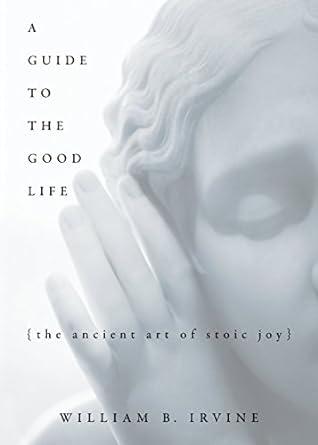

## Introduction

Le philosophe de l’antiquité n’a pas grand chose à voir avec le philosophe moderne, il ne cherche pas à inventer un
nouveau discours ou une nouvelle philosophie avec des tournures de phrases inutilement alambiquées. Non, le philosophe
de l’antiquité est quelqu’un qui mène une vie philosophique, c’est à dire qu’il utilise la philosophie comme un outil
qui lui permet de dresser son caractère. Pour lui, de la même façon que l’on se forge le corps avec l’exercice physique,
on peut se forger l’esprit avec la philosophie.

Les stoïciens ont réalisé qu'une vie en proie à des émotions négatives - comme la colère, l'anxiété, la peur, le chagrin
et l'envie - ne serait pas une bonne vie.

Une des affirmations stoïcienne est que bon nombre des choses que nous désirons, notamment la gloire et la fortune, ne
valent pas la peine d'être poursuivies. Nous porterons plutôt notre attention sur la recherche de la tranquillité. Et
nous devons prendre des mesures pour nous empêcher de tenir pour acquises, une fois que nous les aurons, les choses pour
lesquelles nous avons travaillé si dur. Le moyen le plus simple pour nous d'obtenir le bonheur est d'apprendre à vouloir
les choses que nous avons déjà.

## Les trois règles de vie.

Il faut s’efforcer d’avoir toujours à l’esprit trois règles :

- **Contrôler le discours interne** : dans la vie de l’individu, tout dépend de la manière dont il se représente les
  choses, c’est à dire dont il se les dit à lui-même intérieurement.
- **Faire ce qui rend service à la communauté humaine** : il faut avoir une pensée vouée à la justice et des actions
  accomplies au service de la communauté des hommes.
- **Accepter les événements qui arrivent sans juger** : il faut accueillir toute conjonction d’événements, en la
  reconnaissant comme nécessaire, comme familière, comme découlant de quelque chose de plus grand.

Avec ces trois règles, il s’agit de savoir discipliner son jugement, ses désirs et ses actions.

## Ce que vous devez désirer

Notre choix le plus important dans la vie, selon Épictète, est de nous préoccuper soit des choses extérieures à nous,
soit des choses intérieures. Nous devons abandonner les récompenses que le monde extérieur peut offrir pour obtenir « la
tranquillité, la liberté et le calme ». Les objectifs que vous vous fixez doivent être des objectifs “internes” et de ne
doivent pas dépendre de tiers.

**Le désir est un contrat que vous passez avec vous-même dans lequel vous écrivez "Je refuse d'être heureux tant que je
ne possède pas l'objet de mon désir".**

## Le problème, votre représentation des choses

**"Ce qui dérange les gens, ce ne sont pas les choses elles-mêmes, mais leurs jugements sur ces choses."**

Est-ce que les choses qui m'arrivent m'aident ou me nuisent ? Tout dépend, disent les stoïciens, de mes valeurs. Et mes
valeurs sont des choses sur lesquelles j'ai un contrôle total. Donc, si quelque chose d'extérieur me fait du mal, c'est
ma faute : j'aurais dû adopter des valeurs différentes.

Imaginons qu’un mal vous arrive. Aussitôt, une petite voix dans votre tête va vous souffler : “telle chose m’est
arrivée, on m’a fait du tort”. Essayez donc de supprimer le jugement de valeur que cette petite voix a ajouté et voilà
supprimé la partie “On m’a fait du tort”.

**Être en colère, conclut Sénèque, est une perte de temps précieux**. Lorsque nous nous sentons en colère contre quelque
chose, nous devrions nous arrêter pour considérer son (in)signification cosmique.

Concentrez-vous sur l’instant présent : **“Bien misérable, dit Sénèque, est l’âme obsédée du futur, malheureuse avant le
malheur”**.

## Aimez être ordinaire

**Si nous recherchons un statut social, nous donnons aux autres du pouvoir sur nous** : nous devons faire des choses
calculées pour qu'ils nous admirent, et nous devons nous abstenir de faire des choses qui déclencheront leur défaveur.
Nous devrions être cohérents dans notre indifférence ; nous devrions, en d'autres termes, être aussi dédaigneux de leur
approbation que nous le sommes de leur désapprobation.

**Les stoïciens apprécient hautement leur capacité à profiter de la vie ordinaire** - et en fait, leur capacité à
trouver des sources de plaisir même lorsqu'ils vivent dans des conditions simples.

Musonius suggère que nous serions mieux lotis:

- Si au lieu de travailler dur pour devenir riches, nous nous entraînons à être satisfaits de ce que nous avons.
- Si au lieu de rechercher la gloire, nous surmontons notre besoin d'admiration des autres.
- Si au lieu de passer du temps à comploter pour faire du mal à quelqu'un que nous envions, nous passions ce temps à
  surmonter nos sentiments d'envie.
- Si au lieu de nous assommer en essayant de devenir populaires, nous travaillions à maintenir et à améliorer nos
  relations avec ceux que nous savions être de vrais amis.

## Arrêtez de vous projeter

**Ne te trouble pas toi-même en te représentant à l’avance la totalité de ta vie. Ne cherche pas à additionner
mentalement, dans leur intensité et leur nombre, toutes les difficultés pénibles qui pourraient vraisemblablement
survenir.**
