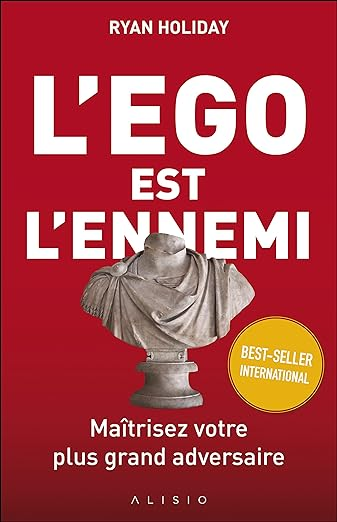

Les questions les plus importantes qu’on puisse se poser dans la vie sont "Qui est-ce que je souhaite devenir ?" et "
Quel chemin vais-je donc suivre ?" Mais l'on peut mieux y répondre en se demandant **Qu’est-ce que j’ai envie de faire
dans la vie ?** car comme le dit le proverbe : "Un homme est travaillé par ce sur quoi il travaille".

Toute une génération de parents et enseignants se sont attachés à renforcer l’estime de soi de chacun. À partir de là,
les thèmes abordés par nos gourous et personnalités ont presque exclusivement visé à inspirer, encourager et persuader
qu’on peut faire ce qu’on a envie de faire. En réalité, cela nous rend faibles. L’arrogance et l’égocentrisme inhibent
tout développement. **Il faut remplacer les tentations de l’ego par l’humilité et la discipline**.

Si vous voulez être autre chose qu’un feu de paille, vous devez vous préparer à vous concentrer sur le long terme. Vous
devez agir et vivre modestement pour pouvoir réaliser vos ambitions. **Puisque nous nous concentrerons sur
l’apprentissage et l’action, et renoncerons à la reconnaissance et au statut**.

**Nos ambitions ne seront pas grandioses, mais itératives**. Un pas après l’autre, on apprend, on se développe, on prend
le temps et on est conscient que cela va prendre du temps. N'oubliez pas qu'on ne se bâtit pas une réputation sur ce que
l’on va faire.

La passion. Trouver sa passion. Vivre passionnément. Inspirer le monde par votre passion. La passion cache une
faiblesse. Son essoufflement, son impétuosité et sa frénésie sont de pauvres substituts de la discipline, de la
maîtrise, de la force, du sens de mission, de la persévérance. **La condition pour atteindre notre objectif n’est pas
d’être brillant, mais de fournir un effort continu**.

Si vous réussissez, vous devez rejeter la couronne de lauriers et continuer à travailler sur ce qui vous a fait réussir
; c’est la seule chose qui vous assurera une continuité dans la réussite. Et d'ailleurs, vous devriez Changer votre
définition de la réussite : **« Le succès, c’est la tranquillité d’esprit qui est le résultat direct de la
satisfaction qu’on éprouve sachant qu’on a tout fait pour devenir le meilleur qu’on puisse être »**. Quand on regardera
son chemin a posteriori, on se dira : "je l’espérais, j’ai travaillé, j’ai eu de la chance". La sobriété est le
contrepoids qui doit équilibrer la réussite. Surtout si les choses vont de mieux en mieux.

Quoi que vous ayez fait jusqu’à présent, mieux vaut rester un éternel étudiant. Si vous n’avez plus envie d’apprendre,
vous êtes déjà en train de mourir. Lisez un livre sur un sujet que vous ignorez. Mettez-vous dans une pièce où vous
serez la personne la moins bien informée.

Faites votre devoir. Faites-le bien. Puis attendez le Jour du jugement dernier et ne laissez pas des éléments extérieurs
décider si quelque chose en valait la peine ou non.