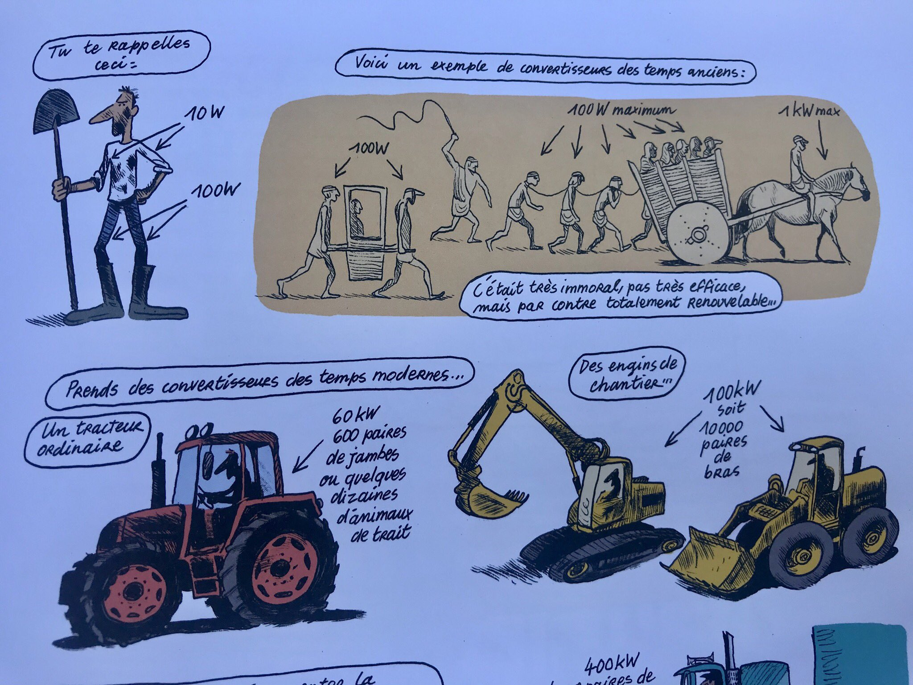

Jancovici rappelle que pour remplacer l’#agriculture mécanisée, il faudrait la force cumulée de 600 personnes ou 60
chevaux de trait pour obtenir la même puissance qu’un seul tracteur.

D'ailleurs les tenants du mouvement comme Nicolas Mirouze indiquent un besoin exceptionnellement fort en main d'œuvre
comme cet appel le montre : « Installer un million de paysans dans les campagnes, seule façon de limiter le recours aux
pesticides ». Et
pourtant, [personne ne semble vouloir venir travailler dans les champs](https://rmc.bfmtv.com/actualites/sciences-nature/personne-n-est-venu-le-desarroi-de-ces-agriculteurs-qui-ne-trouvent-pas-de-main-d-oeuvre-en-france_AV-202012090597.html)
.

Pour info, ce robot peut traiter 500 000 plantes par heure avec 95 % de produits chimiques en moins
[https://www.youtube.com/watch?v=sV0cR_Nhac0](https://www.youtube.com/watch?v=sV0cR_Nhac0)