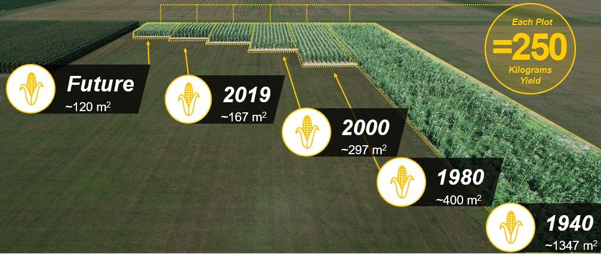

On a des tendances de fond comme un retour à l'agriculture vivrière, mais c'est justement cette forme d'agriculture
destructrice de planète et d'écosystèmes qui nous a conduit à arracher la majeure partie de nos forêts en Europe. Et il
nous a fallu des centaines d'années pour réparer les dommages causés... Alors le bois a aussi été utilisé pour la
construction, notamment de navires, mais il semblerait que l'agriculture reste de loin la première raison.

Un des principaux avantages de l'agriculture "moderne", c'est qu'elle a permis un découplage entre le nombre d'humains
sur terre et la surface nécessaire pour les nourrir:

Et voici un graphique sur l'évolution des terres agricoles par pays:

Voici aussi un schéma qui représente bien le changement:

Une étude suédoise conclut que le passage de l'agriculture conventionnelle à l'agriculture biologique nécessiterait
jusqu'à 130 % de terres agricoles en plus pour maintenir
les [rendements](https://www.sciencedirect.com/science/article/abs/pii/S0308521X22000403).

Une étude réalisée de 2018 à 2022 montre que l'agriculture bio française a des rendements très inférieurs à
l'agriculture conventionnelle : en moyenne -55% pour le blé, -42% à -49% pour l'orge, -30% à -37% pour le maïs, -28%
pour le tournesol, -24% pour le soja.
[Rendements bio](https://agreste.agriculture.gouv.fr/agreste-web/download/publication/publie/Pri2308/Primeur2023-8_RendementsGdesCultures.pdf)

[Quant à l’agriculture urbaine, elle émettrait 6 fois plus de CO2 que l'agriculture conventionnelle](https://www.radiofrance.fr/franceculture/podcasts/avec-sciences/l-agriculture-urbaine-un-bilan-carbone-plus-lourd-que-l-agriculture-conventionnelle-7404775)
