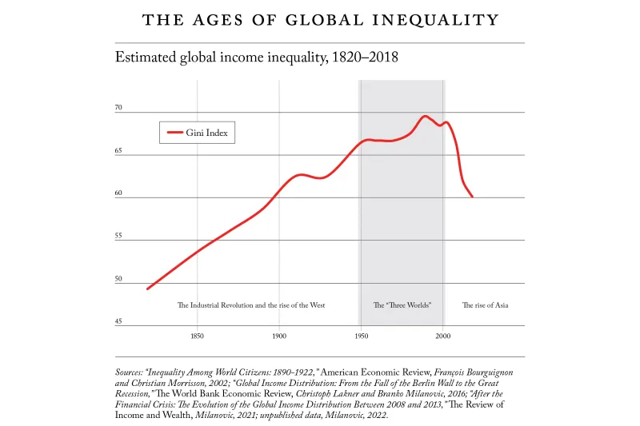

La richesse d’un individu est calculée à partir de son actif net, soit le total de ses biens (typiquement la valeur de
son logement et de son épargne) moins ses dettes (emprunt immobilier ou pour ses études par exemple).

Avec cette façon de calculer, un jeune diplômé américain de la prestigieuse université d’Harvard qui vient de décrocher
son premier emploi, mais qui s’est endetté pour payer ses études, est mathématiquement plus pauvre qu’un réfugié syrien
qui a tout perdu et qui traverse les frontières pour échapper à la guerre.

On en arrive à des raisonnements ahurissants:

- Si on prend un enfant avec 10 € d'argent de poche aura une fortune supérieure à la fortune cumulée d’un peu plus de
  deux milliards de personnes...
- Si on prend l'indicateur imparfait du revenu, rien qu'avec 21 000 euros par an (soit le revenu médian français en
  2016), vous faîtes déjà partis des 2,2% les plus riches du monde.
- Si on prend le patrimoine, avec un patrimoine de 75 000 euros en France, vous faîtes déjà partis des 10% les plus
  riches la planète (note, le patrimoine médian en France c'est un peu plus de 110 000 euros).

Les inégalités mondiales diminuent, et sont au plus bas depuis + de 100 ans. L'écart de revenu entre tous les citoyens
du monde, ajusté des différences de prix entre pays, n'a pas été aussi faible depuis les années 1890:

[https://www.foreignaffairs.com/world/great-convergence-equality-branko-milanovic](https://www.foreignaffairs.com/world/great-convergence-equality-branko-milanovic)