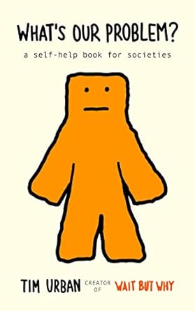

## Esprit primitif et esprit supérieur

L'esprit primitif est un ensemble de comportements codés presque automatique qui permettent aux animaux de simplement
survivre. Ces comportements évoluent très lentement ce qui fait qu'un cerveau primitif est en fait optimisé pour
survivre dans l'environnement de ses ancêtres.

Pour les animaux, ce système marche très bien, car leur environnement, lui aussi, n'évolue pas très vite. Pour les
humains, c'est une autre histoire. Grâce à nos superpouvoirs (langage, abstraction, relations sociales complexes,
planification...), nous avons complètement changé notre environnement à une vitesse dépassant de loin la vitesse
d'évolution de notre cerveau primitif.

Un petit parallèle pour illustrer la chose : pour se déplacer, les insectes nocturnes ont mis au point il y a quelques
millénaires une technique imparable: fixer un astre (la lune par exemple) et se déplacer en gardant un angle constant
par rapport à lui. Mais les humains ont inventé l'ampoule! Et nous voyons depuis des milliers petits animaux volants (
moustiques, mouches, papillons...) irrémédiablement attirés par ces lumières et mourir d'épuisement en tournant
autour... le cerveau primitif de ces animaux ne se met pas à jour assez vite...
Et c'est aussi un problème pour nous, notre esprit primitif humain interprète mal le monde que nous avons construit.
C'est notre esprit primitif qui, par exemple, va nous pousser à acheter une barre chocolatée par pur plaisir alors que
ce n'est pas bon et que nous n'en avons pas besoin.

Mais nous avons aussi un esprit supérieur qui arrive à penser à l'extérieur de soi, à réfléchir sur soi et tirer parti
de ses expériences. L'esprit primitif, lui, pense surtout à survivre, à se reproduire et aider ses enfants à se
reproduire. Il est souvent calme, mais arrive parfois à prendre le contrôle comme quand vous vous jetez sur un paquet de
bonbons et que vous l'avalez d'un seul coup.

## Pourquoi pense-t-on ce que l'on pense ?

Votre esprit supérieur sait que l'esprit humain est parfois délirant et il ne veut pas que vous le soyez. Au fur et à
mesure que vous apprenez des choses, il est tout à fait capable de faire évoluer vos croyances. Votre esprit primitif ne
pense pas la même chose, ce qui est important pour lui, c'est de garder les croyances qui semblent les plus utiles pour
vous aider à survivre.

Ces croyances-là, l'esprit primitif va les considérer comme une partie fondamentale votre identité et elles vont pour
lui être la clé pour que vous restiez intégré aux groupes/communautés dont vous faites parties. Il cherche la
**confirmation** de vos croyances existantes là où votre esprit supérieur cherche la **vérité**.

### Quand on pense comme un scientifique

Vous partez d'un point A et vous suivez les preuves jusque-là où elles vous mènent :

- Vous récoltez l'information sachant que la plupart des informations que nous utilisons est indirecte. C'est du savoir
  accumulé par d'autres que nous "injections" dans notre cerveau.
- Vous la vérifiez et vous devez là savoir quand vous devez "faire confiance". Généralement, on évalue la qualité d'une
  source en fonction de la qualité de ses prédictions passées.
- On formule des hypothèses.

Ensuite, on passe au test des hypothèses, et cela peut mal se passer, car il peut avoir complètement tort. Ce n'est pas
grave, l'idée ici étant d'arriver au fur et à mesure la vérité. On intègre les erreurs/critiques et on recommence le
process.

### Quand on pense comme un fan de sport

La plupart des fans de sports veulent regarder un match "juste". Ils ne veulent pas d'arbitres corrompus même si cela
ferait gagner leur équipe. Ils ne veulent pas de joueurs dopés même si cela ferait gagner leur équipe. Mais ils ne font
pas non plus "que" regarder un match, ils ont un parti pris pour leur équipe, ils sont choisi un camp.

Dans ce cas-là, votre esprit primitif a corrompu votre esprit supérieur en y insérant le biais de confirmation, ce biais
qui va vous pousser à confirmer vos croyances. Vous allez donc chercher des preuves bien sûr, mais surtout celles qui
confirment vos croyances.

### Quand vous pensez comme un avocat

Un avocat va penser un peu comme un fan de sport, mais un fan de sport peut changer d'avis. Un avocat ne cherche pas la
vérité, il est dans une équipe, un point c'est tout. Quand vous êtes un avocat, vous ne commencez pas votre réflexion
comme un scientifique, vous partez de votre conclusion et vous remontez le fil.

Quand vous êtes comme cela, vous n'arrivez quasiment plus à apprendre de nouvelles choses et vous pouvez arriver à
croire n'importe quoi.

### Quand vous pensez comme un fanatique

Les fanatiques pensent que leurs idées sont sacrées, qu'elles sont fragiles, précieuses et qu'elles ne doivent jamais
être remises en cause. Quand vous débattez avec un fanatique, les choses deviennent très vite tendues parce que ces gens
s'identifient à leurs idées et challenger leurs idées revient à les insulter.

## Cultures

Une définition de la culture que l'on peut donner est "**comment nous faisons les choses ici**". Chaque humain baigne
dans plusieurs cultures (le fait de devoir vivre dans plusieurs cultures fait partie des choses qui rendent la vie des
humains compliqués).

La culture d'un groupe influence ces membres avec un système d'incitation. Ceux qui respectent les règles de la culture
seront récompensés en étant accepté, respecté et aimé. Ceux qui ne respectent pas les règles de la culture seront
ridiculisés, rejetés, punis.

Il existe deux façons de traiter les idées :

- Ideal lab : on part du principe que les personnes et les idées sont deux choses séparées. Les personnes doivent être
  respectées, mais les idées peuvent être challengées.
- Chambre d'échos : penser comme le groupe est la seule façon d'être accepté. Les idées sont sacrées et ne doivent
  jamais être remises en cause, dire "je ne sais pas" est un signe de faiblesse et la personne et son idée sont une
  seule et même chose.

La chambre d'écho créée ce que l'auteur appelle des golems, des monstres idiots et dangereux.
Le génie humain est un produit de la collaboration humaine.
Les golems sont ce qui se passe quand les humains se comportent comme des fourmis : conformité stricte avec la colonie
et haine de ceux qui sont différents.

### Le système libéral

Construire sur le principe des idées a démarré dans l'occident (depuis la Grèce antique) avec des idées comme les droits
de l'homme, l'égalité devant la loi, la tolérance et la liberté.

On peut dire que la nature humaine est constante, ce qu'elle produit dépend de quel environnement on la place d'où
l'importance d'avoir des droits fondamentaux à la vie, la propriété et la liberté.

Dans le système libéral, une innovation clé est qu'un individu ne peut pas utiliser la force physique pour obtenir ce
qu'il veut. Il doit convaincre les autres de lui donner ce qu'il veut. Cela a créé un système où les gens doivent se
convaincre les uns les autres et où les idées sont challengées.

Un système libéral évolue avec deux forces :

- Les "progressistes" : ils veulent faire progresser la société en changeant le statu quo. C'est un peu la pédale d'
  accélérateur.
- Les "conservateurs" : ils veulent garder ce qui marchent et éviter l'érosion des qualités de la société. C'est la
  pédale de frein.

Les progressistes sont aussi ceux qui génèrent de nouvelles idées, non testées auparavant, et qui seront pour certaines
très mauvaises.

## La spirale du tribalisme

Il y a un dicton "moi contre mes frères, mes frères et moi contre mes cousins, mes cousins et moi contre les
étrangers...". Un Golem doit toujours être dans un conflit "Nous contre eux" et ce qui permet à deux golems de
fusionner, c'est d'avoir un ennemi commun.

À la base, ce n'est pas une mauvaise chose, car cela permet de créer des liens forts entre les membres d'un groupe. Mais
quand on est dans une chambre d'écho, cela peut devenir très dangereux.

Dans les années 50, 60, 70 et 80, il y avait des ennemis communs (Nazis, communistes...) qui permettait de maintenir une
unité. Avec la perte de ces ennemis communs, les golems se sont mis à chercher des ennemis à l'intérieur de chaque pays.
Même dans les partis politiques, on a commencé à voir des conflits internes de plus en plus violents, avec une
disparition de la pluralité idéologique pour aller vers la pureté idéologique.

Désormais, **on déteste et on ne fait pas confiance aux autres parties politiques au lieu de ne simplement pas voter
pour eux.**

En 1949, la commission fédérale des communications (FCC) a mis en place la règle de l'équité (fairness doctrine) qui
obligeait les médias à présenter les deux côtés d'un débat. Cette règle a été supprimée en 1987 et on a vu une montée en
puissance des médias partisans. Beaucoup d'entreprises/média ont bien compris qu'il était beaucoup plus simple de vendre
à l'esprit primitif qu'à l'esprit supérieur. Il faut simplement permettre à celui qui écoute de confirmer son identité,
de critiquer un autre groupe que le sien et rajouter un peu de ragot.
Idem pour les algorithmes des réseaux sociaux, regardez s'ils parlent à votre esprit supérieur ou à votre esprit
primitif. Regardez bien à quel point ils ont envie de vous faire rejoindre un golem pour agir contre un autre.

Ce tribalisme transforme les humains que nous sommes en de loyales colonies de fourmis. Dans les années 70, il était
très courant de voter pour un parti à la présidentielle et pour un autre au congrès. Cela n'existe plus, peu importe le
candidat. Voter contre l'idéologie de son parti n'est plus acceptable, c'est un blasphème.

## L'exemple des républicains dans les années 60

Dans les années 50, les modérés républicains étaient aux manettes avec un des leurs à la présidence : Eisenhower. Arthur
Larson disait d'ailleurs : "En politique, comme aux échecs, celui qui se trouve au centre de l'échiquier a une position
imbattable". Mais une frange plus fondamentaliste du parti républicain a commencé à se développer bien qu'ils furent
très minoritaires au début.

William Rusher et Clifton White ont alors mis en place une stratégie pour prendre le contrôle du parti républicain en
ciblant en premier une organisation très présente sur les campus : "Young Republicans". Ils ont semé le chaos dans les
instances de décisions puis ils se sont mis à proposer des choses très clivantes (abolition de l'impôt fédéral, sortie
des nations unies, soutien à la ségrégation...). Ils ont réussi à prendre le contrôle du parti républicain en 1964,
notamment en harcelant ceux qui n'étaient pas assez à droite à leur goût.

Goldwater était tombé dans une forme d'extrémisme en allant jusqu'à déclarer : "L'extrémisme dans la défense de la
liberté n'est pas un vice, la modération dans la poursuite de la justice n'est pas une vertu".

## La montée du wokisme

### Deux types de justice sociale

**Les libéraux**
Les tenants "classiques" de la justice sociale sont ceux qui pensent que le pays doit respecter les promesses qu'il fait
à ceux qui y vivent. Ils pensent que le pays a mal fait non pas à cause de ses valeurs, mais parce qu'il a échoué.
L'idée est que le pays fait beaucoup pour améliorer la vie de ses citoyens, mais qu'il peut faire mieux. C'est le
discours de Martin Luther King ou de Barack Obama.

Si l'on veut représenter cela sous une forme de pyramide :

- À la base, la notion que les gens peuvent savoir ce qui est "vrai" grâce à la raison et à la science.
- Ensuite, viennent des idées fondamentales comme la liberté de parole, d'entreprendre, de religion, de propriété...
- Au-dessus, on a les lois, normes et institutions qui protègent ces idéaux.

**Les fondamentalistes de la justice sociale**

Le mouvement woke est ancré dans des idées et des philosophies très différentes.

Tout d'abord, une de ses racines est le marxisme qui considère que les choses que les libéraux considèrent comme les
fondations d'une bonne société doivent être démantelés. Ils pensent que la raison et la science sont des outils
d'oppression qui ne servent qu'à exploiter.

Les théories marxistes (après autant d'échecs) ont été mises à jour pour créer la théorie critique (voir notamment
Herbert Marcuse). Cette théorie dit que ce que les libéraux ont mis en place ne servent qu'à exploiter (science,
culture, éducation ou institutions...). Ernesto Laclau et Chantal Mouffe ont proposé un nouveau modèle de lutte des
classes : la lutte des identités, car la lutte des classes était devenue obsolète.

Alors que les libéraux voient des exemples d'oppressions comme des exceptions, les fondamentalistes de la justice
sociale pensent que les exemples d'oppression sont des révélations de la vraie nature de la société.

Après la théorie critique, nous avons la notion de privilège. Les fondamentalistes de la justice sociale pensent que les
gens qui ont des privilèges ne peuvent pas comprendre les gens qui n'en ont pas. C'est l'idée de "fausse conscience"
qui fait qu'une personne née dans un environnement le considère comme normal. Ceci permet de transformer "classe
dirigeante" et "classe ouvrière" en "privilégiés" et "opprimés".

Puis, on rajoute l'intersectionnalité qui dit que les gens sont oppressés de plusieurs façons à la fois. Cela permet de
créer une hiérarchie des opprimés.

Pour finir, voici le postmodernisme (merci Michel Foucault) qui explique que la vérité n'existe pas, que tout est une
question de pouvoir. Pour eux, politique, religion ou science ne sont que des outils pour maintenir le pouvoir.
Tout devient une construction sociale : le genre, les faits, l'histoire, les mathématiques... qui ne sert qu'à
opprimer. L'objectivité est un mythe.

Quand vous mélangez tout cela, vous obtenez un mouvement "Critical Social Justice" qui prend pour principe que la
suprématie blanche, le patriarcat et l'hétéronormativité sont les forces les plus puissantes de l'histoire et
qu'elles ont tout imprégné: connaissance, langage, culture, institutions, science, raisonnements... jusqu'à la
réalité elle-même.

Et cela ne s'arrête jamais, tous les concepts comme le travail, la planification, la logique, la propriété ou même
la politesse sont tous des outils d'oppression.

**Caractéristiques**

Contre la science : avec ce mouvement, on ne se demande pas si une situation est raciste, on se demande à quel point
une situation est raciste. C'est l'inverse de la méthode scientifique, on part de la conclusion et on remonte le fil.
Toute complexité est balayée d'un revers de main et devient : blanc versus noir, homme versus femme, hétéro versus
homo, colonisateur / colonisé. Di Angelo explique même que c'est une force omniprésente - rien n'est vérifiable,
rien n'est discutable. Kendi explique lui que "Nier l'existence du moindre racisme est raciste".

Toute différence est raciste : avec ce mouvement, toute différence est une injustice. On est plus sur une égalité
des chances, mais sur une égalité des résultats.

L'égalité n'est plus un but : comme le dit Kendi "le seul remède aux discriminations racistes sont les
discriminations antiracistes". Pour eux, tout est un jeu à somme nulle, la seule façon de faire progresser des gens
est de faire descendre ceux qui sont au-dessus d'eux.

**Une chambre d'écho**

Être woke, c'est croire, ceux qui ne pensent pas pareil sont immédiatement traités de raciste, misogynes ou transphobes.

D'ailleurs, la théorie du point de vue est utilisée pour expliquer que chaque groupe n'a pas accès aux mêmes
connaissances et permet de facilement réprimander un membre récalcitrant avec un "Stay in your lane". Si tu n'es pas
blanc, tu n'as par exemple pas l'authorité pour parler de race. Grâce à ce raisonnement, même une personne qui dit
quelque chose de pertinent peut être simplement réduite au silence.

Pour l'anecdote, une des tenantes du mouvement (Robin DiAngelo) blanche a fait une liste de points qui ne devaient
pas être autorisé durant des cours de justice sociale. Elle y explique que si un étudiant noir dit qu'il n'est pas
victime de racisme, il est tout à fait normal de ne pas le laisser dire cela et de ne pas accepter sa perspective.
Clairement, on est obligé d'écouter la voix des opprimés, mais seulement si elle dit ce que l'on veut entendre ce
qui peut se résumer en "si tu es noir, et que tu penses que ton expérience est différente de celle que j'énonce, tu
ne penses pas par toi-même" (ce qui est profondément raciste et arrogant).

**Inconsistance morale**

Pour les SJF, le racisme = préjudice + pouvoir et le pouvoir ne peut s'exercer que dans un sens, du haut vers le bas.
Ceci autorise toutes les pires généralités comme cet article du New York Times qui explique qu'une femme noire et
une femme blanche ne peuvent pas être amies" ou cet autre article où une libraire qui n'accepte pas qu'un couple de
blanc puisse entrer dans son magasin.

Cette libération de paroles racistes basées sur la couleur de peau va de pair avec un abaissement de ce qui est
autorisé de dire pour ceux en position de pouvoir. Des questions/phrases anodines comme "d'où viens-tu?" ou "je ne
suis pas raciste", "il n'y a qu'une race" ou demander de l'aide en mathématique à une personne asiatique sont devenues
racistes.

Dans son livre "Nice racism", DiAngelo critique le fait même pour un blanc de sourire considérant que "trop sourire
permet aux blancs de masquer leur haine des noirs".

**Innocence et culpabilité**

Pour les SJF, la culpabilité et la présomption d'innocence sont des outils de pouvoir. On le voit aux USA que l'on
passe de "Believe women" à "Believe all women" puis "Automatically believe all women".

## Comment conquérir une société

### Étape 1 : Contrôler de la parole

Les histoires présentées dans le livre présentent systématique le même processus:

- L'incident : quelqu'un écrit ou dit quelque chose de "normal" pour la société pour la plupart des gens, mais qui
  est jugé être un blasphème par les SJF.
- Le contrecoup : des manifestations sont organisés dans les institutions et sur les réseaux sociaux pour demander
  des excuses, des démissions, des changements de politiques... bref une punition exemplaire.
- Le moment de vérité : les leaders dans les institutions doivent soit se positionner avec les SJF, soit contre eux
  en promouvant la liberté d'expression et la liberté académique.
- Ils cèdent : dans la plupart des cas, ils défendent la liberté d'expression, mais ils cèdent quand même. Ils
  s'excusent, ils changent des politiques, ils licencient des gens... et cela ne suffit jamais.
- Les institutions doivent prêter allégeance : elles doivent se plier à leurs demandes et les promouvoir.

Ces petits groupes arrivent à utiliser des institutions comme le New York Times, Google ou des universités pour
faire punir ceux qui ne pensent pas comme eux. Dans son étude de 2020, le Cato Institute a montré qu'à part à
l'extrême gauche, la plupart des gens se sentent empêchés de dire ce qu'ils pensent par peur des représailles.

Ceci nous amène au paradoxe de Popper : « pour maintenir une société tolérante, la société doit être intolérante à
l'intolérance. » Mais qui décide de ce qui est intolérant? C'est complexe, mais l'idée de Popper est de surtout
combattre ceux qui refusent le débat rationnel et qui utilisent à la place l'intimidation comme réponse à la
critique de leurs idées.
Les critiques attaquent les idées, ce qui est ce qui est insupportable avec la cancel culture, c'est qu'elle attaque
les gens et empêche les discussions.

### Étape 2 : Forcer les gens à écouter

Depuis 2020, les employés de Disney ont été forcés de suivre des formations sur la "justice sociale" et la
"diversité". On les a forcés à accepter certains concepts : "Vous devez vous éduquer sur les privilèges que vous
avez", "l'équité ne suffit pas", "vous ne pouvez pas ne pas être raciste si vous êtes blancs", "il y a forcément de
la politique au travail"... American express a forcé ses employés à écrire leur race, leur orientation sexuelle,
leur âge, leur genre... Des institutions ont aussi expliqué aux employés qu'ils ne devaient pas croire "qu'on ne
puisse pas 'voir les couleurs', ou que la mérite est un mythe.

Pourtant, les études, comme celle d'Al-Gharbi, montrent que ces études n'ont aucun effet sur le racisme. On se
retrouve donc à forcer des employés à accepter des idées qui ne sont pas prouvées et qui sont même parfois
controversées. Cela ne fait que renforcer le tribalisme et la polarisation.

Et dans les écoles, il y a la même logique. Les écoles de Seattle ont mis en place des cours de mathématiques
"ethniques" avec des questions comme "qui détient le pouvoir dans un cours de mathématique ?" ou "Est-ce vraiment
important que les calculs soient justes".

### Étape 3 : Forcer les gens à parler

"Le silence est violence" est un des derniers slogans des SJF. Cela veut dire que si vous ne parlez pas, vous êtes
complice. On force donc des entreprises et des salariés à prendre position publiquement sur des sujets politiques.
Si ce n'est pas fait, la personne sera accusée de racisme, de sexisme ou de transphobie.

Ceci a notamment été théorisée par Di Angelo dans son livre "Is everyone really equal?" où elle explique que "le
manque d'intérêt pour les questions de justice sociale est un signe de racisme" ou "ne pas être engagé dans des
actions anti racistes" est raciste. Kendi va encore plus loin en déclarant "Dire qu'on est neutre et donc non
raciste est un masque pour racisme". De toute façon, pour lui, le capitalisme est raciste et on ne peut être non
raciste si l'on n'est pas anti capitaliste.

## La solution

La leçon principale de ce livre est que les gens qui se sont faits attaquer n'ont reçu que très peu de soutien, il
faut donc du courage. C'est d'arrêter de dire des choses auxquelles vous ne croyez pas. Comme le disait Marc Aurel, "Si
ce n'est pas vrai, ne le dis pas".

### A intégrer:

https://www.dailysignal.com/2023/04/03/racist-left-screams-quiet-part-out-loud/
https://twitter.com/wesyang/status/1643468689302233089
https://twitter.com/DrDavidLey/status/1637147850059444225
https://twitter.com/realchrisrufo/status/1625932143737044997
https://twitter.com/RichardHanania/status/1679970523013615618
https://twitter.com/monitoringbias/status/1661367696917942273
https://twitter.com/paulg/status/1650383234511908865
https://twitter.com/OuranosMK/status/1673249072902201347
https://twitter.com/robkhenderson/status/1651262744278999041